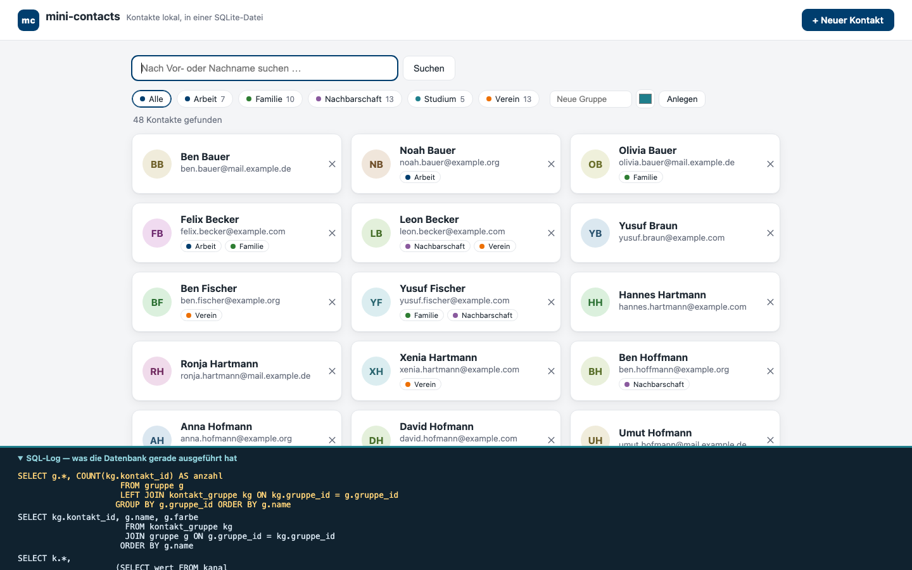
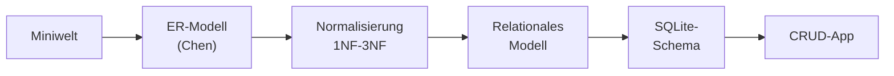
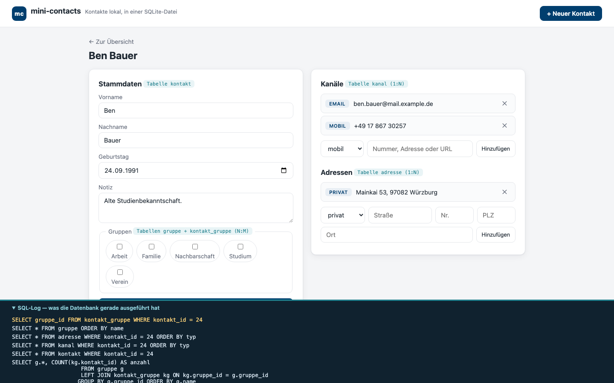

# mini-contacts

**Eine Kontaktverwaltung als komplette Datenbank-Fallstudie** — von der
Miniwelt über das ER-Modell (Chen), Normalisierung und relationales Modell
bis zur laufenden CRUD-Anwendung auf SQLite. Entstanden für die Vorlesung
Datenbanken (THWS Business School).



## Warum dieses Projekt?

Datenbankentwurf lernt man nicht an Folien allein. `mini-contacts` geht
den ganzen Weg einmal ehrlich durch — jeder Schritt ist dokumentiert,
begründet und im Code wiederzufinden:



| Schritt | Dokument |
|---------|----------|
| 1. Fachliche Vorüberlegungen (Miniwelt, Anforderungen) | [docs/01_vorueberlegungen.md](docs/01_vorueberlegungen.md) |
| 2. ER-Modell in Chen-Notation | [docs/02_er_modell.md](docs/02_er_modell.md) |
| 3. Normalisierung: 1NF → 2NF → 3NF | [docs/03_normalisierung.md](docs/03_normalisierung.md) |
| 4. Relationales Modell | [docs/04_relationales_modell.md](docs/04_relationales_modell.md) |
| 5. Physisches Modell in SQLite | [docs/05_physisches_modell.md](docs/05_physisches_modell.md) |
| 6. Fake-Daten (seed.py, Mockaroo, Faker, KI) | [docs/06_fake_daten.md](docs/06_fake_daten.md) |
| 7. Architektur der Anwendung | [docs/07_architektur.md](docs/07_architektur.md) |

Das begleitende Foliendeck liegt in [slides/](slides/).

## Die App

* **Kontakte** anlegen, suchen, bearbeiten, löschen
* je Kontakt beliebig viele **Kanäle** (mobil, Festnetz, E-Mail, Web) und **Adressen**
* **Gruppen** mit Farben, N:M-Zuordnung per Klick, Filter in der Übersicht
* **SQL-Log-Panel**: die App zeigt zu jedem Klick das tatsächlich
  ausgeführte SQL — das didaktische Herzstück



## Schnellstart (Windows / macOS / Linux)

Voraussetzung: Python 3.9 oder neuer.

```bash
git clone https://github.com/swrobuts/mini-contacts.git
cd mini-contacts
pip install flask
python seed.py      # Demo-Daten erzeugen (48 Kontakte)
python app.py       # dann http://127.0.0.1:5050 öffnen
```

Mehr braucht es nicht: SQLite ist in Python eingebaut, die Datenbank ist
die Datei `contacts.db` im Projektordner. Zum Zurücksetzen:
`python seed.py --fresh`.

## Tests

Die Regressionstests verwenden temporäre Datenbanken; die eigene
`contacts.db` bleibt unverändert:

```bash
python -m unittest discover -s tests -v
```

Die zusätzlichen Tests für Löschbestätigung und ungespeicherte Formulare
benötigen Node.js (ab Version 18), aber keine npm-Pakete:

```bash
node --test tests/test_ui.cjs
```

## Selbst erkunden

```bash
sqlite3 contacts.db
```

```sql
.tables
.schema kontakt
SELECT k.nachname, g.name
  FROM kontakt k
  JOIN kontakt_gruppe kg ON kg.kontakt_id = k.kontakt_id
  JOIN gruppe g          ON g.gruppe_id   = kg.gruppe_id;
```

## Lizenz

MIT — siehe [LICENSE](LICENSE). Fake-Daten, keine echten Personen;
E-Mail-Domains nach RFC 2606 (`example.org` u. a.).
