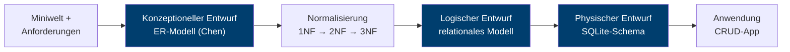

# Schritt 1 — Fachliche Vorüberlegungen

> **Lernziel:** Bevor eine Tabelle existiert, wird die *Miniwelt* beschrieben:
> Welcher Ausschnitt der Realität soll in der Datenbank abgebildet werden,
> und was muss die Anwendung damit können?

## 1.1 Die Miniwelt

Wir bauen eine **persönliche Kontaktverwaltung**, die lokal auf dem eigenen
Rechner läuft — ohne Datenbankserver, ohne Cloud, ohne Konto.

Die Miniwelt in vier Sätzen:

1. Es gibt **Kontakte** — Personen mit Vorname, Nachname, optional
   Geburtstag und einer Notiz.
2. Ein Kontakt ist über **Kanäle** erreichbar: Mobilnummer, Festnetz,
   E-Mail-Adresse oder Webseite — beliebig viele davon.
3. Ein Kontakt kann **Adressen** haben (privat, Arbeit, sonstige) —
   auch hier: keine, eine oder mehrere.
4. Kontakte lassen sich in **Gruppen** ordnen (Familie, Arbeit, Verein, …).
   Ein Kontakt kann zu mehreren Gruppen gehören, eine Gruppe enthält
   mehrere Kontakte.

Schon diese vier Sätze enthalten die spätere Datenbankstruktur: Die
Substantive werden Entitäten, die Verben werden Beziehungen, und Formulierungen
wie "beliebig viele" oder "mehreren" sind die Kardinalitäten.

## 1.2 Funktionale Anforderungen

| Nr. | Anforderung |
|-----|-------------|
| FA1 | Kontakte anlegen, anzeigen, ändern, löschen (CRUD) |
| FA2 | Je Kontakt beliebig viele Kanäle erfassen und entfernen |
| FA3 | Je Kontakt beliebig viele Adressen erfassen und entfernen |
| FA4 | Gruppen anlegen und Kontakte mehreren Gruppen zuordnen |
| FA5 | Kontaktliste nach Name durchsuchen |
| FA6 | Kontaktliste nach Gruppe filtern |
| FA7 | Beim Löschen eines Kontakts verschwinden seine Kanäle, Adressen und Gruppenzuordnungen mit |

## 1.3 Nicht-funktionale Anforderungen

| Nr. | Anforderung | Konsequenz für den Entwurf |
|-----|-------------|----------------------------|
| NF1 | Läuft lokal auf Windows, macOS und Linux | Python + Browser-UI, keine native Installation |
| NF2 | Kein Datenbankserver nötig | **SQLite**: die Datenbank ist eine einzige Datei |
| NF3 | Daten bleiben beim Neustart erhalten | echte Datenbank statt Datenstrukturen im Speicher |
| NF4 | Nachvollziehbar für die Lehre | die App zeigt zu jeder Aktion das ausgeführte SQL |

## 1.4 Der Entwurfsweg

Der Weg von der Miniwelt zur laufenden Anwendung folgt dem klassischen
Phasenmodell des Datenbankentwurfs:

Jede Phase hat ein eigenes Dokument in diesem Ordner:

| Phase | Dokument |
|-------|----------|
| Konzeptioneller Entwurf | [02_er_modell.md](02_er_modell.md) |
| Normalisierung | [03_normalisierung.md](03_normalisierung.md) |
| Logischer Entwurf | [04_relationales_modell.md](04_relationales_modell.md) |
| Physischer Entwurf | [05_physisches_modell.md](05_physisches_modell.md) |
| Fake-Daten | [06_fake_daten.md](06_fake_daten.md) |
| Anwendung | [07_architektur.md](07_architektur.md) |
