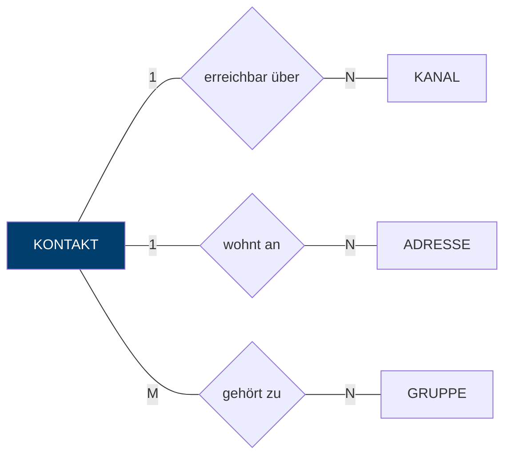
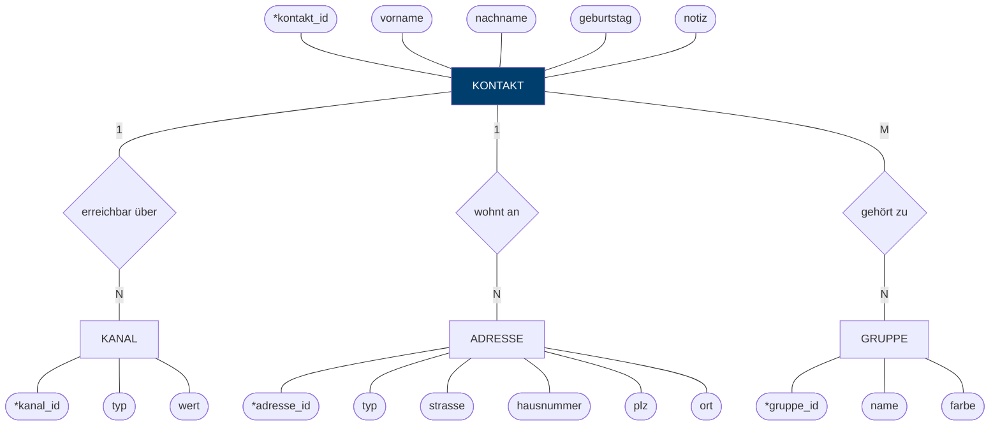

# Schritt 2 — Konzeptioneller Entwurf: das ER-Modell (Chen-Notation)

> **Lernziel:** Die Miniwelt wird in Entitätstypen, Beziehungstypen und
> Attribute übersetzt — noch völlig unabhängig von Tabellen oder SQL.

## 2.1 Die Bausteine der Chen-Notation

| Symbol | Bedeutung | Beispiel |
|--------|-----------|----------|
| Rechteck | **Entitätstyp** — ein Ding der Miniwelt | KONTAKT |
| Raute | **Beziehungstyp** — verbindet Entitätstypen | *hat*, *gehört zu* |
| Ellipse | **Attribut** — Eigenschaft einer Entität | vorname, plz |
| Unterstrichen | **Schlüsselattribut** — identifiziert eindeutig | <u>kontakt_id</u> |

*(In den Mermaid-Diagrammen unten sind Schlüsselattribute mit `*` markiert,
weil Mermaid keinen Unterstrich in Knoten darstellt.)*

## 2.2 Entitätstypen und Beziehungen im Überblick

Aus den vier Sätzen der Miniwelt ([Schritt 1](01_vorueberlegungen.md))
ergeben sich vier Entitätstypen und drei Beziehungstypen:

**Lesart:** *Ein* Kontakt ist über *N* Kanäle erreichbar (1:N). *Ein* Kontakt
wohnt an *N* Adressen (1:N). *M* Kontakte gehören zu *N* Gruppen (N:M).

## 2.3 Das vollständige ER-Diagramm mit Attributen

## 2.4 Entwurfsentscheidungen — und warum

1. **Warum ist KANAL eine eigene Entität und nicht drei Spalten
   (`telefon`, `mobil`, `email`) am Kontakt?**
   Weil "beliebig viele" in der Miniwelt steht. Feste Spalten wären eine
   künstliche Obergrenze — und leere Spalten für alle, die nur eine Nummer
   haben. Das ist genau die Wiederholungsgruppe, die uns in der
   [Normalisierung](03_normalisierung.md) wieder begegnet.

2. **Warum ist GRUPPE keine Spalte am Kontakt?**
   Ein Kontakt kann in *mehreren* Gruppen sein und eine Gruppe enthält
   *mehrere* Kontakte — eine N:M-Beziehung. N:M lässt sich grundsätzlich
   nicht in einer Spalte abbilden (dazu mehr im
   [relationalen Modell](04_relationales_modell.md)).

3. **Warum künstliche Schlüssel (`kontakt_id`) statt natürlicher
   (Name + Geburtstag)?**
   Namen sind nicht eindeutig (zwei "Anna Müller"), können sich ändern
   (Heirat) und Geburtstage sind optional. Ein künstlicher Schlüssel
   (Surrogatschlüssel) ist stabil, kompakt und bedeutungsfrei.

4. **Kardinalitäten genauer notiert (min, max):**
   KONTAKT (0,N) — erreichbar über — (1,1) KANAL: Ein Kanal gehört zu genau
   einem Kontakt; ein Kontakt kann auch (noch) keinen Kanal haben.
   Die Beziehungstypen sind damit *existenzabhängig*: Kanäle und Adressen
   existieren nur mit ihrem Kontakt (→ später `ON DELETE CASCADE`).

**Weiter:** [Schritt 3 — Normalisierung](03_normalisierung.md)
