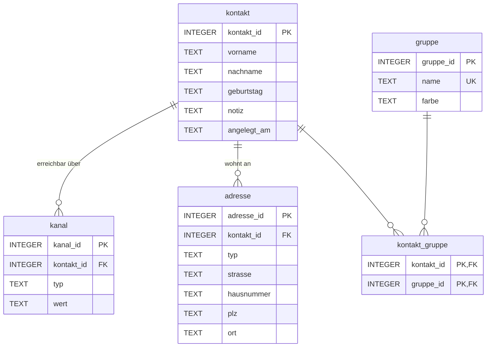

# Schritt 4 — Logischer Entwurf: das relationale Modell

> **Lernziel:** Das ER-Modell wird nach festen Regeln in Relationen
> (Tabellen) übersetzt. Beziehungen werden zu Fremdschlüsseln — oder zu
> eigenen Tabellen.

## 4.1 Die Abbildungsregeln

| ER-Konstrukt | wird zu |
|--------------|---------|
| Entitätstyp | eigene Tabelle, Schlüsselattribut wird Primärschlüssel (PK) |
| 1:N-Beziehung | Fremdschlüssel (FK) auf der N-Seite |
| N:M-Beziehung | eigene **Koppeltabelle** mit zwei Fremdschlüsseln, die zusammen den Primärschlüssel bilden |
| Attribut | Spalte |

Angewendet auf unser ER-Modell:

* `KONTAKT`, `KANAL`, `ADRESSE`, `GRUPPE` → je eine Tabelle.
* *erreichbar über* (1:N) → `kanal.kontakt_id` als FK.
* *wohnt an* (1:N) → `adresse.kontakt_id` als FK.
* *gehört zu* (N:M) → Koppeltabelle `kontakt_gruppe(kontakt_id, gruppe_id)`.

## 4.2 Das relationale Schema (Krähenfuß-Notation)

**Lesart der Kanten:** `||--o{` heißt "genau eins zu null-bis-viele".
Ein Kanal gehört zu genau einem Kontakt; ein Kontakt hat null bis viele
Kanäle. Die N:M-Beziehung zwischen `kontakt` und `gruppe` ist im
relationalen Modell *verschwunden* — sie lebt jetzt in der Koppeltabelle
`kontakt_gruppe`, die zu beiden Seiten je eine 1:N-Beziehung hat.

## 4.3 Warum die Koppeltabelle zwei Schlüssel gleichzeitig hat

`kontakt_gruppe` hat einen **zusammengesetzten Primärschlüssel**
`(kontakt_id, gruppe_id)`:

* Beide Spalten einzeln sind Fremdschlüssel (referenzielle Integrität:
  es gibt keine Zuordnung zu einem Kontakt oder einer Gruppe, die nicht
  existiert).
* Beide zusammen sind der Primärschlüssel — dieselbe Zuordnung kann
  dadurch nicht zweimal erfasst werden.

## 4.4 Notationsvergleich: Chen vs. Krähenfuß

| | Chen | Krähenfuß (Mermaid `erDiagram`) |
|--|------|-------------------------------|
| Ebene | konzeptionell — Kommunikation mit Fachanwendern | logisch — nah an der Implementierung |
| Beziehungen | eigene Symbole (Rauten), auch N:M direkt | nur 1:N-Kanten; N:M braucht die Koppeltabelle |
| Attribute | Ellipsen am Entitätstyp | Spaltenliste in der Tabelle |
| typische Nutzung | Entwurfsdiskussion, Lehre | Schemadokumentation, Werkzeuge |

**Weiter:** [Schritt 5 — Physisches Modell in SQLite](05_physisches_modell.md)
