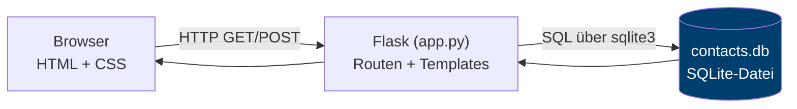
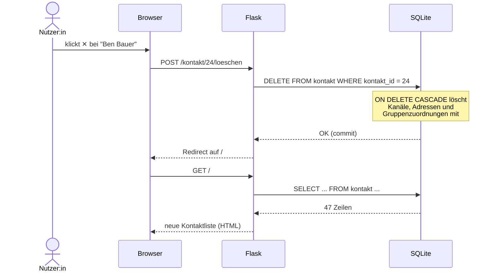

# Schritt 7 — Die Anwendung: Architektur und CRUD

> **Lernziel:** Sehen, wie eine Anwendung mit der Datenbank spricht:
> Jeder Klick in der Oberfläche wird zu SQL — und die App zeigt es.

## 7.1 Architektur

Drei Schichten, bewusst minimal gehalten:



* **Browser:** HTML und CSS mit einem kleinen JavaScript für Löschbestätigung
  und den Schutz ungespeicherter Formulare, kein JavaScript-Framework.
  Die UI ist austauschbar — die Datenbank bliebe dieselbe.
* **Flask:** übersetzt HTTP-Anfragen in SQL und Ergebnisse in HTML.
  Ein einziges File ([app.py](../app.py)).
* **SQLite:** läuft im selben Prozess; `contacts.db` ist die gesamte
  Datenhaltung.

## 7.2 Ein Klick, einmal quer durch alle Schichten

Was passiert, wenn jemand einen Kontakt löscht:



## 7.3 CRUD ↔ SQL ↔ HTTP

Die vier Grundoperationen jeder datengetriebenen Anwendung:

| CRUD | SQL | in mini-contacts (Beispiel) |
|------|-----|------------------------------|
| **C**reate | `INSERT` | "Speichern" bei neuem Kontakt → `INSERT INTO kontakt …` |
| **R**ead | `SELECT` | Übersicht, Suche, Gruppenfilter → `SELECT … LIKE ?` |
| **U**pdate | `UPDATE` | "Speichern" beim Bearbeiten → `UPDATE kontakt SET …` |
| **D**elete | `DELETE` | ✕-Knopf → `DELETE FROM kontakt WHERE …` |

Das **SQL-Log-Panel** am unteren Rand der App zeigt die letzten zwölf
tatsächlich ausgeführten Statements — mit eingesetzten Parametern. Damit
lässt sich in der Vorlesung jeder Klick live auf sein SQL zurückführen.
Die Parameterdarstellung stammt aus dem SQLite-Trace; dadurch werden auch
Apostrophe und Fragezeichen innerhalb von Werten korrekt angezeigt.
Bei Text mit einem NUL-Zeichen werden SQL und Parameter getrennt mit sichtbaren
Escapezeichen angezeigt, weil der SQLite-Trace diesen Text sonst abschneidet.

Für die Namenssuche registriert die App auf jeder Verbindung die SQL-Funktion
`casefold()`, die Python-Unicode-Casefolding verwendet. Damit findet etwa
`MÜLLER` auch `Müller`. Diese Funktion gehört zur App-Verbindung und ist in
einer separat gestarteten SQLite-Konsole nicht automatisch vorhanden.

## 7.4 Zwei Handwerksregeln, die auch im Kleinen gelten

1. **Parametrisierte Abfragen statt String-Basteln.** Alle Werte laufen
   als `?`-Parameter in `execute()` — nie per f-String in das SQL. Das
   verhindert **SQL-Injection** (und ist nebenbei schneller). Das Log-Panel
   zeigt die von SQLite expandierten Parameter nur *für die Anzeige* an.
2. **Integrität gehört in die Datenbank, nicht in die App.** Wertebereiche
   (`CHECK`), Eindeutigkeit (`UNIQUE`), Löschregeln (`ON DELETE CASCADE`) —
   alles im Schema. Die App kann Fehler machen; das Schema hält stand.

## 7.5 Projektstruktur

```text
mini-contacts/
├── app.py               # Flask-App: Routen, SQL, SQL-Log
├── seed.py              # Fake-Daten-Generator (Standardbibliothek)
├── contacts.db          # die Datenbank (entsteht beim ersten Start)
├── db/
│   └── schema.sql       # das physische Schema (DDL)
├── docs/                # dieser Entwurfsweg, Schritt 1-7
├── slides/              # Foliendeck zur Fallstudie
├── static/style.css     # das gesamte Styling
├── static/app.js        # Bestätigung und Schutz ungespeicherter Eingaben
└── templates/           # HTML-Templates (Jinja2)
    ├── base.html        #   Grundgerüst + SQL-Log-Panel
    ├── index.html       #   Kontaktliste, Suche, Gruppenfilter
    └── form.html        #   Anlegen/Bearbeiten samt Kanälen & Adressen
```
